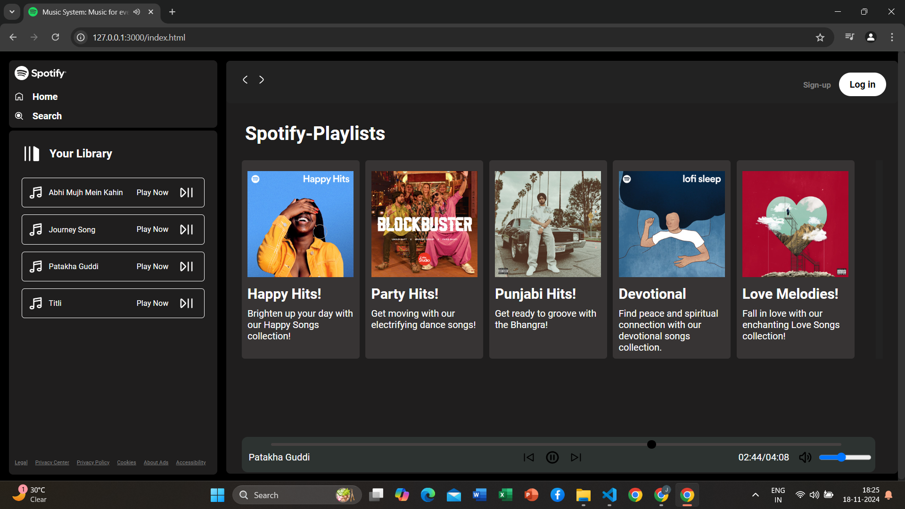
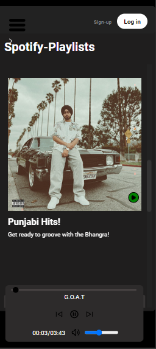
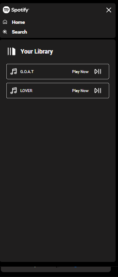

# Music System Web Application 🎵

This is a responsive web-based music system built using only **HTML**, **CSS**, and **JavaScript**. The system organizes songs into five categories: **Love**, **Dance**, **Punjabi**, **Devotional**, and **Happy**. 

## Features:
- **Song Categorization:** Songs are organized into separate folders based on their category.
- **Responsive Design:** The site is fully responsive, ensuring a seamless experience across devices.
- **Two Script Versions:**
  - **script.js:** Full version supporting the folder-based song organization.
  - **script2.js:** A simpler version that directly fetches songs from the root folder without organizing them into subfolders.

---

## Preview 📸

### Home Page

### Responsive

### Library

---

## Tech Stack
- **HTML**: Structure and layout of the application.
- **CSS**: Styling for a responsive and visually appealing design.
- **JavaScript**: Handles interactivity and song management.

---

